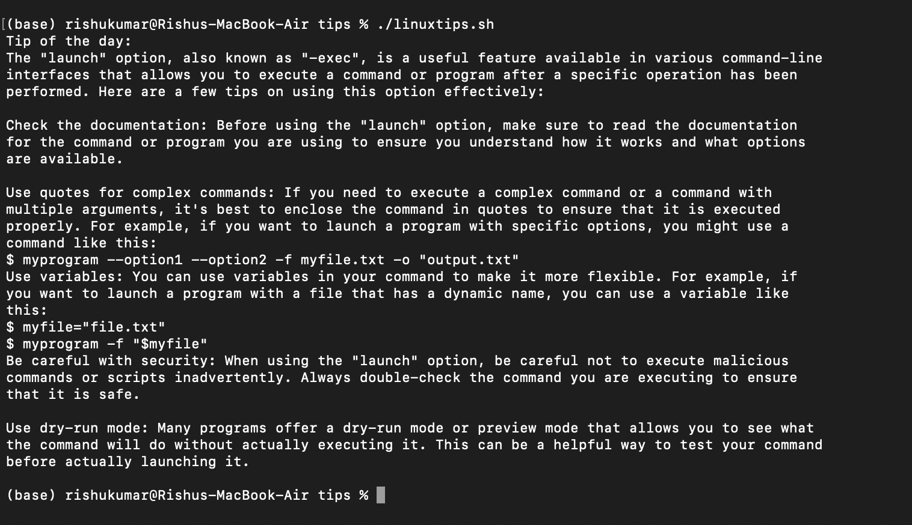

# Tip of the Day Bash Script

This bash script displays a different "Tip of the day" each time it is run. It also allows for skipping tips and deactivating the functionality for single users.

##Setup Instructions

1. Clone the GitLab repository to your local machine using:
    ``` 
    git clone https://gitlab.tamk.cloud/server-tech-2023-b-r-k/tip-of-the-day-1.0-bash-script-server-tech-2023-rishu-kumar.git
    ```
2. Navigate to the cloned repository folder: 
    ``` 
    cd tip-of-the-day-1.0-bash-script-server-tech-2023-rishu-kumar
    ```
3. Make the bash script executable: 
    ```
    chmod +x linuxtips.sh
    ```
4. Configure your personal linux environment to run the script every time when entering the terminal of your own Linux host or taking a SSH connection to your personal Linux host. To do this, add the following line to the end of your ** .bashrc file **:
    ```
    ~/tips/linuxtips.sh
    ```
5. Open a new terminal window to test the script. You should see a different tip displayed each time.

## Example:



